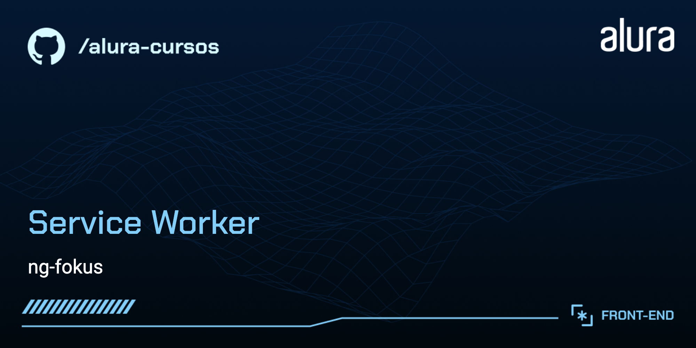

# ng-fokus

A ng-fokus é uma aplicação da ferramenta do método Pomodoro (gestão de tarefas), baseado no funcionamento do site promofocus. O projeto está desenvolvido em Angular 18 com service worker.

## 🔨 Funcionalidades do projeto

O aplicativo permite que os usuários gerenciem suas tarefas utilizando a técnica Pomodoro, ajudando a aumentar a produtividade e a manter o foco.

## ✔️ Técnicas e tecnologias utilizadas

As técnicas e tecnologias utilizadas no projeto são:

- `Angular 18`: framework para construção de aplicações web
- `Service Worker`: para suporte offline e melhoria de performance  
- `Componentes Angular`: para modularização e reutilização de código
- `RxJS`: para programação reativa
- `TypeScript`: linguagem de programação utilizada no desenvolvimento

## 📁 Acesso ao projeto

Você pode [acessar o código fonte do projeto no GitHub](https://github.com/Charlinho/ng-fokus).

## 🛠️ Abrir e rodar o projeto

Para abrir e rodar o projeto, siga os passos abaixo:

1. Clone o repositório do projeto:
   ```bash
   git clone https://github.com/Charlinho/ng-fokus.git
   ```
2. Navegue até o diretório do projeto:
   ```bash
   cd ng-fokus
   ```
3. Instale as dependências:
   ```bash
   npm install
   ```
4. Execute o projeto:
   ```bash
   ng serve
   ```
5. Abra o navegador e acesse `http://localhost:4200/` para ver a aplicação em execução.

## 📚 Mais informações

Para mais informações sobre o projeto e suas funcionalidades, visite o [repositório no GitHub](https://github.com/Charlinho/ng-fokus).
